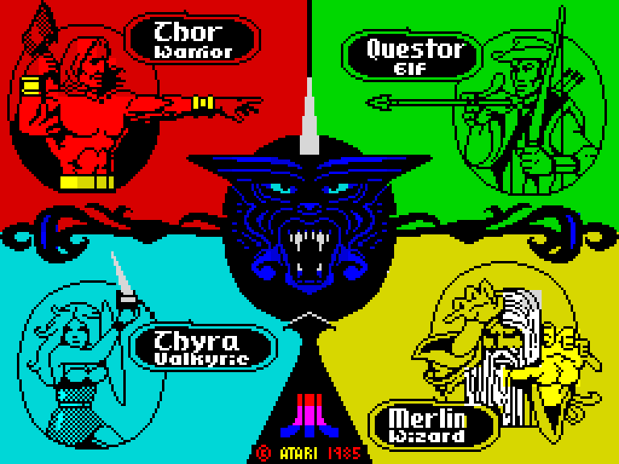
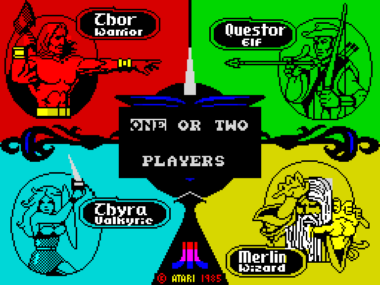
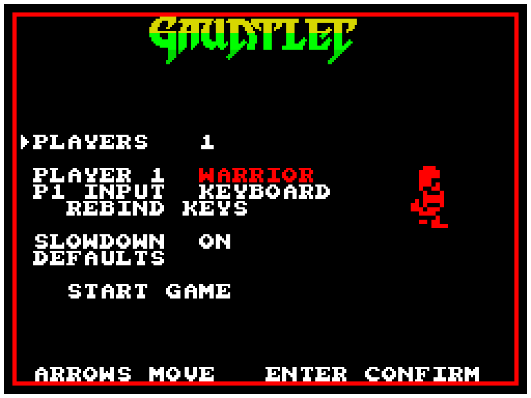
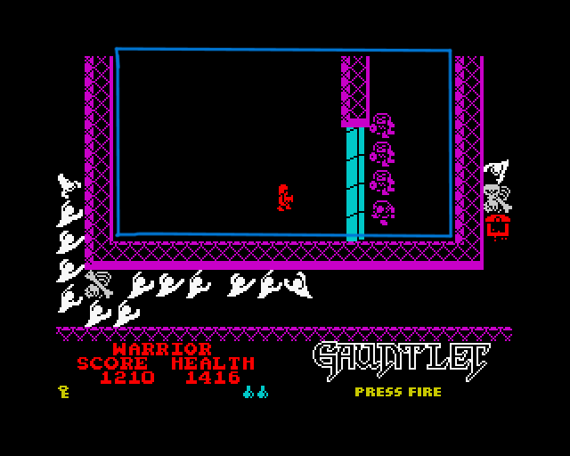
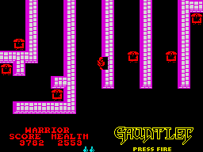
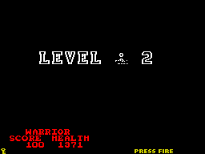
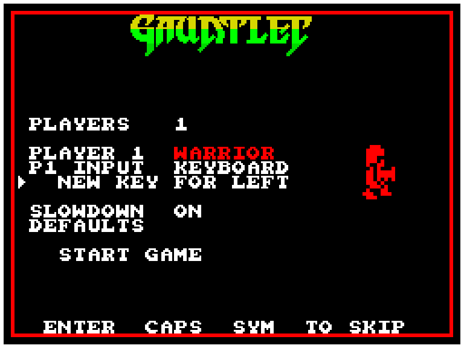
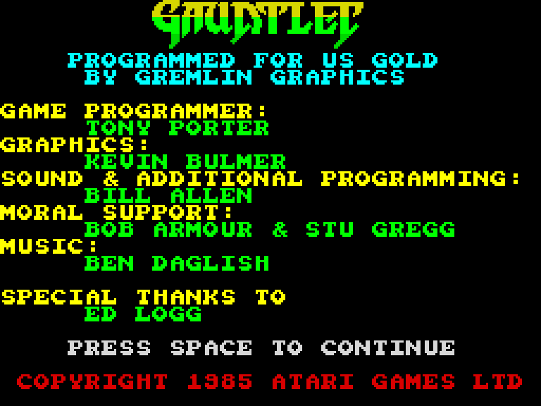
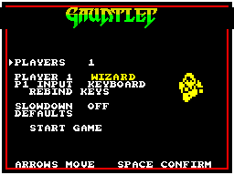
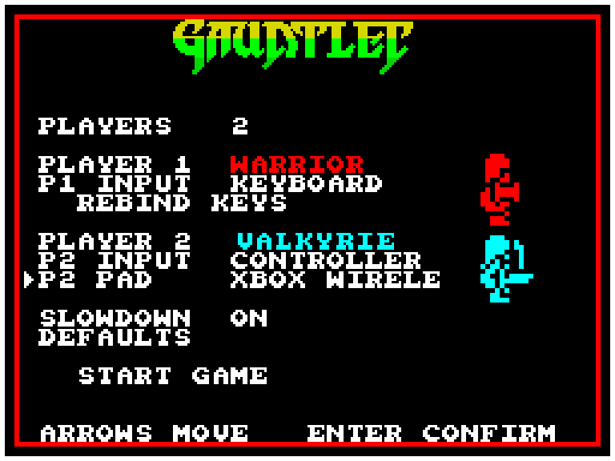

# From Tape to Browser: Porting Gauntlet to JavaScript

## 1. Introduction

This is the story of a from-scratch, faithful port of *Gauntlet* — the 1986 U.S. Gold ZX Spectrum conversion of the Atari coin-op — built directly from the original Z80 binary rather than from a design document or a modern reimagining. The goal, in the order it was actually pursued, was to reproduce the machine exactly first — down to its self-modifying code, its packed-BCD arithmetic, and its load-dependent frame-rate sag — and only once that engine was standing and verified against the real Z80 would anything be allowed on top of it. A second, more ambitious layer was on the table early on: smooth sub-cell camera scrolling and four independent players, things the 1986 hardware never had. It never got built — not for lack of time, but because once the faithful engine was actually finished, the honest verdict was that the authentic reproduction was the thing worth having, not a waypoint to something bigger, and the project has stayed exactly what it set out to be ever since. The layer that *did* get built on top, covered in Section 7, is smaller and squarely in service of the original game rather than a departure from it — a modern options screen, controller support, a handful of quality-of-life fixes — each one held to the same faithful/added boundary discipline described next. Before any of that: this same working directory had already hosted one complete port — *Chuckie Egg* (1984, A&F Software) — and the lessons from finishing it were written up as a 199KB field manual, `PORTING-ZX-TO-JS.txt`, before a single line of Gauntlet-specific code existed. What follows is the Gauntlet port's own chronicle — its architecture, its boundary between the faithful and the added, and the long list of bugs that were found only because the original machine was asked, directly, to disagree.

*(A brief editorial note for whoever reads this alongside the repository: the root-level `ENGINE.md` and its sibling `NOTES-game.md` / `NOTES-physics.md` / `NOTES-sound.md` / `NOTES-loader.md` files describe that earlier Chuckie Egg port — different game, different addresses, different files entirely. The real, actively-maintained architecture record for Gauntlet lives at `notes/NOTES-engine.md` (274KB and growing), alongside `notes/NOTES-battery.md`, `notes/NOTES-loader.md`, and `notes/NOTES-render.md`, with the actual engine at `web/gauntlet.html` and the build tooling at `tools/build.py`. Where this chronicle draws on the Chuckie Egg project at all, it's flagged explicitly, because that's where several of the Gauntlet port's hard-won rules were first learned.)*



## 2. Architecture: How a 1986 Binary Becomes a Browser Engine

### 2.1 The Prime Directive, and where it came from

`PORTING-ZX-TO-JS.txt` opens with a rule stated in capitals, because everything else in the project is downstream of it:

> WHEN YOUR MODEL AND THE ORIGINAL MACHINE CODE DISAGREE, THE MACHINE CODE IS RIGHT — INCLUDING WHEN IT LOOKS WRONG.

Three corollaries follow it, and all three show up, by name or in spirit, throughout the Gauntlet correction log. Corollary 1.1 says every rule is a hypothesis until the original answers for it — which is why the verification harness (Phase 7 of the manual's 16-phase pipeline) is built *before* the engine (Phase 12). Corollary 1.2 — called "the single highest-value habit" in the manual — says that when a routine looks like it's cutting a corner, find out what compensates before fixing it. Corollary 1.3 says the quirks *are* the game: prove each one against the original, then freeze it in a regression test, because "a quirk without a test will eventually be removed by someone acting in good faith, possibly you, three days later." Every section below is, in one way or another, a demonstration of these three rules being applied for real, against a much bigger and more devious binary than the one they were written for.

The manual also codifies a lettered failure catalogue (B1–B7, C1–C7, D1–D10, F1–F3, G1–G10) and a 19-item diagnostic battery (Q1–Q19) — a checklist of questions a port has to answer about *any* ZX Spectrum binary before writing engine code. `notes/NOTES-engine.md` cites these codes as live, working shorthand — "manual B2b," "manual G6" — which is the clearest proof that the manual wasn't shelved after Chuckie Egg shipped; it was actually used, on a game roughly an order of magnitude more complex.

### 2.2 The structuring rule: same shape, not an equivalent shape

Section 7.1 of the manual lays down a rule that sounds almost too strict to be useful, and turns out to be exactly what makes the rest of the methodology work:

> The structure is not an approximation of the original's, it is the same structure — that is what makes a routine map possible, a differential test meaningful, and every later claim checkable by someone reading both side by side.

Its worked example is small but sets the tone for the whole codebase: a Z80 `AND 7 / RET z` becomes JavaScript's `if ((px & 7) === 0) return;` — not refactored into some more "natural" JS idiom, not hoisted into a helper, just transliterated. Tidying up the dispatch into something a JS developer would write from scratch would destroy the one property the whole method depends on: the ability to put the Z80 disassembly and the JS side by side and read them as the same routine.

### 2.3 The screen model: a second Spectrum living in high memory

Gauntlet keeps a complete second Spectrum display in memory — bitmap plus attributes, 6,912 bytes, sitting at `$C000`–`$D7FF` and `$D800`–`$DAFF` — and it was found, not assumed. The proof is arithmetic: the blitter's attribute-address formula only produces `$D8`/`$D9`/`$DA` if the attribute base is `$D800`, not the real screen's `$5800`, and rendering the raw `$C000` bitmap directly produces a picture of dungeon walls with no player sprite anywhere in it, because the player lives in a different bank of that same shadow buffer.

An earlier draft of the render notes described this shadow screen as a persistent canvas. It isn't. `$B4FF` clears rows 0–19 of the shadow bitmap and attributes *every single pass* — the dungeon is redrawn from scratch each frame, not accumulated. The only thing that survives the clear is four SHOT sprite banks, at `$D080`/`$D280`/`$D480`/`$D680`, and they survive purely because they sit in the `Dx80`–`DxFF` halves the clear routine steps over. Get that detail wrong and shots either vanish every frame or the dungeon geometry never updates.

Scrolling on this shadow screen was cross-correlated pixel-by-pixel across 14 traced passes while holding a direction key, and the offset that comes out is *exclusively* 0 or −8 pixels — never anything in between: the original scrolls in whole 8-pixel steps and nothing finer. A smooth sub-cell scrolling layer was floated early in the project on the strength of that measurement — it would have needed to add its own camera offset purely in the renderer, leaving the simulation's camera cell-quantized, "or the faithful/added boundary assertion will not hold" — but the layer itself was never built. The engine's own camera stayed exactly as measured: cell-quantized, in 8-pixel steps, precisely as faithful as the original.

### 2.4 Sprites: 33 bytes, not 66, and a miscount that hid the format for a long time

The sprite record format looked unsolved for a while because an earlier pass through the blit routine (`$9DD2`..`$9E49`) stopped counting `POP DE` instructions at a branch mid-routine, tallied eight of them, and concluded a record was 16 bytes — and because every sampled pointer happened to land on an even-numbered record, a 66-byte stride looked like the real unit. Re-disassembling all the way out to the terminating `JP (IX)` found sixteen `POP DE`, not eight. The real record is 33 bytes: one attribute byte plus 32 bitmap bytes (16 rows of 2 bytes, row-major, left byte first, MSB first), blitted opaque — no mask, no OR, not a single shift instruction. Getting this wrong doesn't just misdraw one sprite; it silently offsets every other pointer into the sprite table by a multiple of the wrong stride.

### 2.5 Rendering primitives, kept deliberately dumb

The renderer is restricted to solid-fill rectangles — `fillRect`, nothing more exotic — and the manual is candid that this isn't a style choice: it's what makes a headless pixel-diff harness, a draw-call recorder, and a filmstrip tool buildable at all, and "this cannot be retrofitted later." Tiles aren't redrawn from an artist's reconstruction; they're sampled from the original's own shadow-screen pixels. This is a small decision with an outsized payoff, described in more detail in Section 6, where an "honest lower score" replaces a misleadingly high one once the sampling coverage was widened.

### 2.6 Timing: three shapes in the manual, one very particular shape in Gauntlet

Section 7.2 of the field manual generalizes the accumulator pattern from the Chuckie Egg port into three engine shapes: free-running (`passAcc += dt * 3_500_000`, clamped as a stall guard, charging each pass its true T-state cost), frame-synced (with an explicit trap, B6, warning that a fixed 50.08 Hz timestep must never collapse into one update per `requestAnimationFrame` — a 20% speed error on a 60 Hz display, 188% fast at 144 Hz, that "looks completely right"), and ISR-driven, where the unit of time is the interrupt invocation itself.

Gauntlet's actual pass clock turned out to be the ISR-driven shape, and a genuinely strange one. A 48K pass is one `HALT` at `$9CD7`; everything before that HALT runs with interrupts enabled, and everything after it is a fixed 147,491 T-state screen copy plus three interrupt handlers. Because the pass ends on a HALT, its cost is *quantised onto the video-frame grid* — always a whole number of frames, never a fraction. The engine computes this directly:

```
cost = ceil((t + W1) / FRAME_T) * FRAME_T + W2 - t
```

where `W1` (the interrupts-on portion) is built from a live census the engine already has to hand: map-painter cell counts, actor cull classes, the generator window, pass parity, the drain tick, the banner, and the beeper's noise sampler. Against 1,620 held-out real-Z80 passes this model is exact 94.8% of the time. The payoff is concrete and dramatic: the port now runs 12.5 Hz in an empty room, 12.4 Hz in a quiet one, and 8.5 Hz at a generator cluster — against the real machine's measured 12.5/12.1/9.0 Hz. Before this model existed, the engine ran a flat 12.52 Hz everywhere, which is 43% too fast exactly where the game is designed to bite hardest.

### 2.7 BCD, kept packed on purpose

Health is stored as 2-byte packed BCD, big-endian; score as 3-byte packed BCD. The engine keeps both packed rather than converting to plain integers, and that decision alone closed several real bugs (detailed in Section 4): a wrong contact-damage table, a level-counter increment that would have skipped six dungeons had it used BCD instead of the original's plain binary `INC`, and the opposite trap elsewhere, where an earlier build wrongly assumed a level-clear counter used BCD when the real instruction has no `DAA` near it at all.

### 2.8 Self-modifying code, everywhere

`tools/battery.py` flags 29 distinct sites where the game patches its own already-executed bytes — always 16-bit operand pairs, never single bytes. This makes any static coverage map of the binary unreliable in both directions, and it forced two concrete engineering decisions: the test harness must never itself patch the image byte-for-byte (it has to run the real patching code), and differential replay has to re-seed patched operands rather than assume they're constant. The single most consequential instance of self-modification, though, is architectural: the actor-update routine is patched *into the renderer itself* — a `CALL` instruction written into a three-`NOP` hole located inside the sprite-draw routine, after all four of its off-screen culls. An actor's move, AI, and animation update fire only as a side effect of its sprite successfully drawing — not on any independent timer. An actor outside the camera's viewport isn't merely undrawn; it is completely frozen, which is why nothing in the first dungeon stirs until the camera brings it into view. This was verified by predicting, per actor record and camera position, whether the draw loop's visit would reach the patched call — and matching that prediction against thousands of real visits with zero mismatches.

### 2.9 The single-file build

`tools/build.py` restates the manual's packaging rules almost word for word: build the shipped file from a template whose first line loudly says it is generated; inline the game's data as JSON inside a non-executable `<script>` tag, escaping the `</` sequence so the payload can't break out of its own tag; then re-parse that escaped text during the build to prove the escaping held, and fail the build outright if any expected asset is missing. `build.py` enforces exact shapes throughout — 307 dungeon records, 31 packs, the pack numbered `$80` holding exactly 7 sub-blocks, a HUD font of precisely 106 eight-byte glyphs ending at `$7B00`, four high-score tables of 60 bytes each, 464 total SFX frames across 18 effects — and it inlines the whole payload, then re-extracts and re-parses it a second time from the *final written file* to prove the round trip actually held, not just the intermediate step. One comment in the file memorializes a bug that had already shipped once: the player sprite's draw origin "is a measurement, not a constant this file gets to choose — an earlier build hard-coded `(-8, 0)` here and froze a sampling artefact into the engine" (the story behind that artefact is in Section 4).

## 3. The Faithful/Added Boundary

The manual states the rule for adding anything beyond a strict port as a precondition, not an afterthought: build the faithful engine first, complete and verified, and then "make the boundary a TEST, not a promise." It cites, as its own proof of concept, a 400-frame byte-identical fingerprint test run with an earlier enhancement layer on and off. Gauntlet inherits that discipline directly and gives it three concrete, named instances — three module-level flags in `web/gauntlet.html`, each documented in the source as a numbered "DEPARTURE," each defaulting to the shipped modern behavior while leaving the original ROM behavior fully coded, reachable, and switchable back on for verification.

### 3.1 Departure #1 — `FAITHFUL_TAPE_PROMPTS`

The original boots by asking the player to service a physical tape deck three separate times: STOP TAPE (`$C1F2`, an unbounded wait for SPACE with no timeout), PRESS PLAY (`$C520`, plus a measured 47.82-frame loader delay at `$FF12`), and a cold-boot REWIND TAPE prompt (`$B494`). Since Gauntlet's 307 dungeons ship pre-decoded in `build/packdata.json` and `Tape.load()` is pure record selection that never actually waits on anything, these three waits describe a medium the browser port simply doesn't have. Suppressing them was reported to make the port "feel emulated" when they were left in — the loading screen itself is kept, deliberately, because it's content rather than a prompt.

The comment in the source argues the suppression is safe "by construction, not by luck," because the simulation's own update function is never called while any of the three prompts run — they live entirely in front-end loops outside the simulation. `tools/headless.js` turns that claim into a literal fingerprint check: 120 simulated passes with the flag true and false must produce a byte-identical state, and a second check confirms the flag isn't dead code by verifying the front end genuinely starts in a different phase each way.

The boundary work here produced a real regression of its own. Removing the STOP TAPE screen removed the *only* user gesture that existed between page load and the title tune starting — and browsers refuse to run an `AudioContext` without one. The tune advanced into a suspended audio context and played nothing, a bug the state-only fingerprint test was structurally blind to, because the simulation was executing perfectly; only the sound was missing. It was caught in play, not by any existing check, and produced both a fix and a new permanent regression test, plus a lesson that gets repeated throughout this project's history: a removed wait can be load-bearing for something entirely unrelated to what it visibly waits for.

### 3.2 Departure #2 — `STREAMLINED_FRONTEND`

The original's boot sequence asks five separate full-screen questions — PLAYERS, up to two character pickers, up to two control-method pickers — in period joystick jargon (SINCLAIR/KEMPSTON/PROTEK) that means nothing to a modern player. `STREAMLINED_FRONTEND` folds all of it into one options screen using KEYBOARD/CONTROLLER terms, and the equivalence argument is precise rather than hand-wavy: the new path ends by writing the identical five state bytes (`$FFFF`/`$FFFE`/`$FFFC`/`$FFFB`, plus a fifth) that the faithful multi-screen pickers would have written, and nothing downstream of that point — "the whole simulation" — ever reads *how* those bytes were chosen, only what they hold. The old nine-screen graph stays fully coded and fully reachable with the flag set false.

A test built to prove this equivalence turned out, on inspection, not to prove much: checking that both players picking CONTROLLER produced the right `$FFFC`/`$FFFB` bytes couldn't actually show that `optFinish()` assigns those two bytes to the *correct* player, because with both players choosing the same method the assignment is symmetric — swapping it would still pass. The fix was caught by deliberately swapping the assignment and confirming the mixed-methods test failed while the symmetric one stayed green — mutation testing applied directly to the boundary check itself, to prove it has teeth rather than being vacuously true.





### 3.3 Departure #3 — `FAITHFUL_SYM_CHEAT`

This one runs the opposite direction from the other two: most departures default to the modern behavior, but `FAITHFUL_SYM_CHEAT` defaults *false*, because keeping the original's SYM SHIFT walk-through-walls exploit (`$A84D`, `BIT 1,(IY+7)`) always active would mean any keyboard player who rebinds a control to SYM would silently lose wall collision while holding it down. The team frames this explicitly as "a product decision, not a bug: a player who actually wants the cheat has the original to emulate" — and the faithful path stays fully ported and fully tested, just not shipped live.

Proving the cheat is real required something stronger than checking the port's logic against itself: `build/_ghost.json` holds two traces recorded by walking the *same* planted wall-barrier scenario on the real Z80 via `tools/ghostgate.py` — once with SYM held, once without — and the tool asserts the two traces actually differ before it will even write them, a non-vacuity guard on the fixture itself. `headless.js` then confirms both directions: with the flag off (the shipped default), holding SYM changes nothing, matching the plain trace exactly; with the flag on, the blocked step stands precisely as the real machine's trace shows.

### 3.4 Where the pattern came from

The Chuckie Egg precursor is where this discipline was first proven out, and it's worth a short detour because the bug stories there are what motivated Gauntlet's stricter version of the rule. That project's enhancement layer (rewind, replay ghosts, an attract mode) fought with its own faithful side more than once: a rewind that forgot to roll back the pass counter left recorded input stamped against pass numbers that no longer existed, reported by the user only as "the ghost data gets scrambled" and root-caused to one missing key in a snapshot list. A ghost-ranking scheme went through three iterations because each one disagreed with what the player could see on screen — cumulative score, then animation-frame count (which ran 2.4x fast at 144Hz and landed a sprite 67 pixels off-target), before landing on a clock-based measure; investigating that fix, the author caught himself independently re-making the project's own signature mistake — assuming a constant time-per-pass rate — the same error that had made falls run too fast in the physics engine to begin with. And a death that faithfully refilled BONUS and TIME on respawn quietly paid the refund back into the *saved* score used for the leaderboard, inverting its meaning so a sloppier two-death run could out-bank a clean one.

Gauntlet's own render notes show this pattern applied preemptively even to a feature that, in the end, was never built: the 8-pixel-cell scrolling constraint described in Section 2.3 was written down as a boundary condition before a line of smooth-scroll code existed, for a layer the project later chose not to pursue at all — proof that the discipline described in this section holds even when the feature it's guarding never ships.

## 4. Bugs, Hurdles, and Discoveries

What follows is organized by subsystem, but the shape of nearly every entry is the same: something looked wrong, or looked like a shortcut, or simply looked *finished* — and it wasn't, until it was checked against the real Z80.

### 4.1 Movement: five gates, a self-modifying scan, and a loop order four investigations got backwards

A single step in Gauntlet passes through five sequential gates: an opposite-direction cancel, a vertical-before-horizontal ordering, a map test, a 7×7-box actor scan whose own Y-comparison operand is *written by a preceding instruction* (self-modifying, mid-routine), a fourth check against the other player's body, and a fifth check for a pending interaction. An earlier engine version called the actor scan from inside the direction handler behind a bit gate, so it silently skipped on every other 2-unit step — one of six rules in this chain that were each caught purely because a real-Z80-vs-engine differential table disagreed, never by reading the disassembly.

The main loop's actual order is a correction with an unusually embarrassing pedigree: because `$851E CALL $AB94` (actors) textually precedes `$8521 CALL $A43B` in the CALL list, "every earlier report concluded the actors move, then the player moves against their new positions." Four separate investigations reached that same wrong conclusion. Hooking `$8503`/`$A5F0`/`$B58C`/`$AB94` live on the real Z80 showed the opposite: the player's actual move is reached from `$8509 CALL $A38A → $A3AF CALL $A4DD`, firing *before* `$850C`; `$A43B` is only the player's post-move frame and draw bookkeeping. The real order is player-move-and-actor-scan, then camera re-center at `$850C`, then the actor loop at `$851E`, then the pass counter increments. The return-address stack at `$A5F0` settles the argument outright — it literally names the caller, `[$A3B2, $850C]`. Getting this backwards moves a later feature's step to the wrong side of the player's own scan.

A related measurement bug cost "three separate investigations a great deal of effort," in the note's own words. The engine used to claim the original spends two passes on a key pickup where the port spends one, and blamed a missing game rule. The actual cause was in the measuring tool: `tools/sim_move.py` sampled state every four video frames on the assumption that a pass is a constant four frames. It isn't. Measured over 97 real passes, the per-pass frame cost ranged from 3.92 to 5.03, and the key-pickup pass itself cost 5.03 frames — so a fixed four-frame sampling window drifted into the *previous* pass and double-counted a state from that point onward. The fix was to sample on reaching a specific program-counter address instead of a frame count, with the lesson recorded plainly: verify the measuring code before the measured code.

The camera's own clamp carried a similar four-pixel error for a long time, invisible during ordinary play. The first camera model (an instant clamp) matched every prior sample because in ordinary play the player moves at the same 2 units/pass as the camera — a converged tracker and an instant clamp look identical under that condition. Poking the player to `(100,100)` broke the illusion: the real camera settled at `(124,124)`, not the instantly-clamped `(70,70)`. Properly measured, the camera steps ±2 units per pass toward a target with a dead zone of 30 across / 18 down, clamped to `[2,66]` across and `[2,90]` down. The note had previously written the down clamp as `[2,86]` — wrong by exactly 4 — traced to instruction `$B5C3 CP $5A` (`$5A` = 90); holding DOWN for 120 passes on the real machine settles the camera at exactly `(2,90)`.

### 4.2 The boot-time ghost: a speckled blob, and the wrong Spectrum for eleven phases

Two of the project's largest corrections trace back to the exact same root cause — a test harness that never actually ran the game's own boot menu, leaving stale padding bytes sitting in memory where real, chosen values should have been.

The first: `$FFFF` is meant to hold the player's chosen character (0–3), but the captured boot state left it at `$2A` — the loader stub's own leftover padding. The character-bank-select routine at `$BEE5` does `ADD HL,BC` (`BC=$420`) once per unit of that index, so an index of 42 walks `HL` up by `42 * $420 = $10C40`, which wraps mod 64K to `$0C40` — squarely inside the 48K ROM. The game then copies 1,056 bytes of its own ROM code into the player's sprite bank and draws it as a character. This was verified by direct comparison: the memory range `$5F00`–`$6320` in the captured state is a byte-exact copy of ROM `$0C40`. Every "speckled figure" earlier screenshots showed wasn't a decode bug at all — it was the original's own ROM, rendered as a sprite, because nothing had ever told the game who the player was. `tools/fixchar.py` repairs it directly from the tape image.

That same stale-`$2A` pattern corrupted a related decision. `$BE53` reads `$FFFF` to pick the character, and `$BEE5` indexes a stats table at `$BF19` with only four valid entries — index 42 lands 42 entries past the end, producing garbage stats (`$8433=$20`, `$8435=$20`, "not a reachable game state"). This was corroborated three separate ways — the panel prints ELF, the character-3 sprite records carry attribute `$44` (bright green), and shot bank 3 decodes to eight directional arrow sprites carrying the same attribute — "corroborated three ways and proved by none," since nothing that actually writes `$FFFF` in the boot sequence has been found. The fix repairs the *whole* character entry (index 3, elf), not just the two bytes an earlier note singled out, because a garbage `$8433=$20` on a NORTH-facing shot happens to collide with the shot engine's own "exploding" sentinel value and would refire forever without moving.

The second and larger version of the same mistake: RAM `$FFFD`, the 48K-beeper/128K-AY sound-hardware selector, was *also* left at the same stale `$2A` — and because that's non-zero, `$BF21` reads it as "128K present" and enables the AY sound-chip path a real 48K machine never takes. This invalidated the clock model, all of sound, the banner pause, and control-method dispatch until the mistake was found and fixed at what the correction log calls Phase 11 — the note states, without qualification, "EVERY MEASUREMENT UP TO PHASE 11 WAS TAKEN ON THE 128K/AY BRANCH BY ACCIDENT," confirmed by booting three times with `$FFFD` forced to `$00`/`$01`/`$2A` and diffing all of RAM: the `$2A` boot matches the `$01` (AY-enabled) boot at every byte except `$FFFD` itself. No gameplay *rule* actually differed between the two branches (0 mismatches over 2,800 direction rows and 289 two-player rows), which is exactly why it went unnoticed for so long — it silently invalidated infrastructure rather than breaking anything visibly. It's called, in the project's own words, "the single biggest correction the project has made."

### 4.3 Combat: a tier aliasing bug, a dropped carry bit, and a crowd of ghosts that wouldn't die

Contact damage by monster tier looked, on first read, like a clean progression: 10/20/30/40. It isn't. `$A627` tests tier bits in order — `BIT 3,(HL)` first (tier bit 0), then `BIT 4,(HL)` (tier bit 1), falling through only for tier 0 — but tier 3 has *both* bits set, so it takes the same branch as tier 1. The four tiers actually cost 10, 20, 30, and 20, in that order — tier 3 does *less* damage than tier 2. This was measured directly by repainting a monster slot's tier and walking into it: health went 1995 → 1985/1975/1965/1975. Nothing in dungeon 1 uses a tier-3 monster, so no in-game table ever caught the discrepancy — the disassembly did.

A generator's cost per hit looked, in an earlier report, like a clean 3/7/11 refused-pass sequence for values `$20`/`$21`/`$22`. A later re-measurement from a different arrival phase produced 1/5/9 instead — and both are correct, because the cost depends on which pass-counter phase the player arrives on. The real invariant is arithmetic: `hp = ((v-$20)&$FF) mod 3`, computed as a do-while where `SUB 3` runs before `CP 3` (so `$1F` folds through the byte wrap), with damage gated to land only on passes where `($8491 & 3) == 3` — one hit per four passes. Measured directly by hooking `$A6CA`: hits landed at counters 71, 73, 75, 77, 79 with damage 1, 0, 1, 0, 1.

A register-pair swap in the shot-collision routine cost 155 rows of a differential table before it was found. `$8F36` pushes `BC`, applies diagonal collision-probe offsets in place, and on hitting any non-zero cell pops the *saved* pair into `DE` instead of `BC` — so from that point on, every downstream consumer (the impact bit-clears, both collision scans, the cull, the draw) reads the wrong register pair entirely. Concretely: a shot stopped at `x=2` with the camera also at 2 becomes `x=0` after the swap, and `0-2` folds negative in the culling math, so the original culls it that same pass. Without reproducing this exact swap, the port's shot state disagreed with the real Z80 across an entire quadrant of movement directions.

The most subtle of the three, and the one that hid the longest: a potion thrown into a crowd was reported to leave a band of ghosts standing where the original clears them. The cause is a swap-and-shrink actor list: removing an actor swaps in the one from the far end of the array to fill the gap, and every removal path except the potion kill returned `true` from `actorUpdate()` to keep the loop cursor on the swapped-in actor for a re-check. The potion kill path returned bare `undefined`, so the cursor advanced past the swapped-in actor and silently skipped it. This was invisible in all 438 existing potion-gate differential rows, because every one of those test scenarios used only 6 of 63 actors — the swapped-in actor was always, by chance, one of the 57 off-camera actors that would have been skipped regardless. A 48-actor grid test finally exposed it: the real Z80 dropped 63 → 15 actors (scoring +500) against the port's pre-fix 63 → 31 (+210). After the fix, both agree exactly, and new permanent "swarm-big" scenarios guard the regression.



The potion's white screen-flash on detonation turned out not to be a playfield effect at all, but the Spectrum's actual overscan border, set from inside the frame-interrupt handler by reading the same "sweep armed" flag bit (`$847E` bit 3) that also does the actual killing — black otherwise, white for as long as the bit is set. Measured directly on the border port: it carries 7 on the throwing passes and 0 on every other pass, and never goes white at all if the player holds no potions. The reason the port never showed this wasn't a missed special case — the engine had no concept of a hardware border whatsoever until this was found and fixed with real `border` state and an on-screen overscan frame.

Finally, holding FIRE freezes the player outright. Bit 4 of `$842E` is tested at `$A57E`; if set and an exemption bit is clear, the entire direction byte is zeroed and the move routine returns immediately — holding fire rotates you in place but you never move. The exemption is cleared every pass via a bit-clear at `$A48D`, not a raw write, which matters because the byte it targets cycles through several other values while walking. The two-player shove mechanic (`$AB24`) is the only other writer of that same exemption bit, which is "the exemption's whole point": a shoved player who is also firing can still be pushed and moved.

### 4.4 The teleport pad saga

This is the project's best example of a bug getting diagnosed backwards, corrected, and then corrected *again* — and each correction changed what the fix actually needed to be.

A play report described getting stuck beside a teleporter on level 8: player at `(4,78)`, cell `(1,19)` free, camera `(2,60)`, "can rotate and fire but not move." An earlier "PROVISIONAL" note explained this away by claiming the *real* ZX Spectrum game gets stuck the same way — treating it as faithfully-reproduced original behavior, not a bug. Driving the actual Z80 disproved that outright: stepping onto a `$30` teleport-pad cell costs exactly one refused pass, then `JP nz,$B195` teleports the player, clearing the arm bit at `$B218` even when the teleport itself bails. The real machine's stall lasts at most a few passes and only along the axis you're pressing — hold a *different* direction (measured as "DOWN×2 then UP") and you're immediately free.

The port's actual bug turned out to be its own: `doTeleportPad()` sets a `teleportArmed` flag and nothing inside a single pass ever clears it again — the only two `= false` sites in the whole engine are a full game reset and a level start. Two of the four test scenarios built to investigate this came out "never moves," and the third — the discriminating scenario — came out "never moves" too. A dedicated differential (`tools/teleportgate.py`) driving an approach-then-escape matrix through both the real Z80 and the built engine found the port disagreeing on 30 of those rows, and the note explains precisely why an earlier, shallower test had missed this entirely: "Holding INTO a pad is indistinguishable from a wall on both sides; the disagreement only shows when the key is RELEASED and another direction pressed" — exactly the input sequence the earlier "the original sticks too" measurement never tried.

There's a second, smaller layer to this same investigation: the underlying distance-scoring table for teleport destinations (`$8469`–`$8479`) has a genuine gap in the original's own data. Decoding it as `n²` for `n = 0..11` works perfectly until index 12, which holds `$A9` — decoding as `169 = 13²`, not `144 = 12²`. The number 144 simply does not appear anywhere in the table. This is the tape's own arithmetic, not a transcription error in the port, and the gate that checks it "asserts the break so a later tidy-up cannot insert the 144" that the original never had.

### 4.5 Sound: two drivers, a duty cycle, and a scribble on the game's own art

Gauntlet ships two complete, mutually exclusive sound drivers — a 48K beeper path and a 128K AY-3-8912 path — selected once at boot by a hardware probe that writes `$D1` through the 128K memory-paging port `$7FFD` and reads it back: a real 48K machine can't page, so it reads back its own written byte and stores 0 in RAM `$FFFD`; a real 128K stores 1. `$BEB9` then permanently rewrites nine opcodes to `RET`, disabling whichever driver wasn't selected. This is the mechanism behind the "wrong Spectrum" bug described in 4.2 — every sound measurement made before that bug was found had unknowingly been exercising the 128K/AY branch on what was supposed to be a 48K tape.

Once the correct 48K beeper branch was actually being measured, its own internal timing held a genuine subtlety: because the tone loop's overhead (`DEC L`, `JR`, `LD A`) all falls on the low half of the square wave, speaker-high lasts `13H+14` T-states but speaker-low lasts `13H+33` — a built-in duty-cycle skew a naive 50%-square-wave reimplementation would completely miss. And the noise mechanism at `$B8CC`, which fires once per drawn object during the blitter's own work, doesn't have a fixed duration in real time: it always runs for exactly 127 calls, but how long that takes depends on how much blit work is left ahead of it. Firing from the player's own move leaves the full blit ahead, giving a burst of 9.8ms; firing from ghost contact during the actor update leaves far less blit remaining, giving 82–87ms — nearly a 9x range. An earlier write-up's "~43ms" figure for this same burst came from averaging the mean spacing of *all* `$B8CC` calls across a whole run, a mean dominated by the silent, fast 68-T-state code path that isn't even the one running during an actual burst.

A subtler bug lived in the Web Audio bridge itself, not in the model of the original hardware. It sized every scheduled buffer by rounding `(frames × sampleRate / FRAME_HZ)` but scheduled its start at the exact unrounded real time — and since a video frame is 880.591 samples, not a whole number, consecutive buffers either overlapped or left silent gaps. This was mostly inaudible in-game because pass boundaries usually coincide with a border write holding the speaker at zero — but the title-tune front end hands the bridge one video frame per buffer with no such border write, so the seam lands mid-waveform. Measured over 584 tune buffers, 238 joins summed two buffers together, with the resulting peak sample reaching 1.1094 against the largest legitimate single-buffer sample of 0.9977 — arithmetic proof of clipping, not an inference. The fix aligned buffer boundaries to a shared sample grid using `Math.floor` instead of `Math.round`; afterward, injected noise on the title tune dropped from −7.5 dB to −177.2 dB.

A related play report — "the sound now has slight noise to it" — turned out to describe two entirely different things, and the investigation is a small essay in how to tell a faithful quirk from an actual bug. The chirp train's *timing* becomes irregular under load because the beeper's tone step runs once per main-loop pass, and pass length genuinely varies 4 or 5 video frames depending on blitter load — the real hardware produces this same jitter (measured standard deviation of 0.502 frames between chirps walking down in dungeon 1), and the port matches it (0.470). Critically, the *pitch* never moves under this jitter — half-periods measured at exactly 609T/1102T in every row of every test scene, a 0.000% change — because the half-period math runs inside a DI-protected HALT loop that blit work cannot touch. Flattening that timing to be metronomic, which an early build of the port actually did, would have made the port *less* faithful, not more. The audio-buffer summing bug described above was the only actual defect in the pair.

Last, one of the odder bugs in the whole project: a play report described a broken colon glyph in "LEVEL : 2," matching a third-party emulator too, suggesting a tape mastering fault. It wasn't the tape. The colon sprite sits at `$BFDF`–`$BFFF`, directly below the shadow screen at `$C000`, and the blit routine runs with the stack pointer pointed at that source data. Under uncontended interrupt timing, an interrupt could land while `SP` was just above `$C000`, and the interrupt service routine's own `PUSH`es overwrote the sprite's tail bytes with real return addresses — readable, byte for byte, as values like `$A2D2` and `$B51D`. Booted under the plain simulator, the record corrupts; booted under a contended-timing simulator that matches real hardware, it stays clean over 300 driven passes. "The tape holds a clean colon and we scribbled on it" — the bug was entirely in the project's own emulation state, not in anything shipped on the original cassette. `introart.py` now verifies every extracted icon against the tape and refuses to ship one that isn't genuinely there.

### 4.6 Rendering and the dungeon decoder

Two smaller corrections in the level-build trace are worth recording because of how they were found: reading the machine directly rather than re-deriving logic from the disassembly. `$91E1` had been thought to move pack material, and `$9EAB`–`$9ECD` had been thought to be the map expander; once the tape pack format was closed independently, `$91E1` turned out to just reassemble the record list from RAM holes the pack's own stub had already unpacked, `$9EAB`–`$9ECD` turned out to be a plain stack blitter, and the real expander lives at `$97CB`, the only routine that actually writes the map. A build-order note is even smaller but load-bearing: transcribed directly off the machine at `$9880`–`$98A7`, `$9BB7` (level ≥ 8 extra objects) runs *before* `$9B0E` (the actor-list partition) — the opposite of what an earlier write-up had recorded.

Tile coverage had its own version of the "looked done, wasn't" pattern. Sampling 17 tiles off one dungeon's screen covered only 89.5% of the cells across all 307 dungeons, and on 33 of them more than half the furniture was simply invisible because its tile had never been captured. The fix decodes the sprite records directly instead of sampling pixels — the same 33-byte format described in Section 2.4, reached via `$7B00` with `id = ((cell-1)&$7F)+1`, and `$9AB9` rebuilding 16 pointers per level from one of five 16-record banks. Coverage becomes every value that actually occurs, cross-checked against the earlier screen-capture sample: 15 of 16 previously-sampled tiles are byte-identical to the decoded record, and the one mismatch is explained cleanly — it's an animated tile that a different routine repoints mid-frame, which the screen capture simply caught at the wrong instant.

The dungeon decoder itself closes on the entire shipped game: 307 of 307 dungeons agree cell-for-cell with a live Z80 RAM dump at 1,024 of 1,024 cells each (314,368 cells total), player starts and actor lists agree 307 of 307, and mirrored levels agree 24 of 24. That mirror number has real teeth behind it — an earlier, incorrect belief that actor lists are *not* mirrored on levels 8 and up scored only 9 of 24 under the same test. The correction: both mirror routines (`$9C06` for rows, `$9C69` for columns) share a tail at `$9C3D`–`$9C68` that transforms not just the wall grid but the player start and *every actor*, via `x := ((x XOR E) + 1) AND $7C`. Since a level 8 or higher is mirrored on three out of every four visits, a port carrying the old, wrong belief "would spawn every monster in the wrong place on roughly 75% of the game."



### 4.7 Two players, no switch

Perhaps the single cleanest architectural discovery in the whole project: there is no one-player/two-player mode switch anywhere in the Gauntlet binary. The image always carries two complete 32-byte player data blocks, and both start out marked "not in the game" (bit 7 of a status byte set). The only instruction anywhere that clears that bit is `$9451 RES 7,(IX+$14)`, gated solely by `$944C BIT 4,(IX+7)` — whether that player has pressed FIRE. One player or two isn't a mode at all; it's entirely emergent from who has pressed fire, through the exact same code path that revives a dead partner mid-game. This directly overturned an earlier guess made *in this same project* that RAM `$FFFD` was the 1P/2P switch — it's actually the 48K/128K sound-hardware selector described in Section 4.2.

The join/"materialise" animation was measured at six frames, not five as an earlier report claimed — the sprite-id sequence at `$7CCE` runs for passes +0 through +5 before switching to the real walk pose on pass +6, and both players get frozen through this sequence at the *start of every level*, not just on first join, because `$B458`/`$B463` call the same placement routine for both players at every level start.

A pair of instructions, `$A924`/`$A944`, had been misfiled entirely as dead code — "a stray-distance test which can never fire for the player himself." That was wrong. They're the live two-player separation limit, and they only looked inert because a preceding instruction clears the carry flag before the "partner absent" early-return check runs, not because of anything about the step size. Enumerated fully: movement is refused whenever the short-way distance between the two players reaches 61 units horizontally or 37 vertically, which — mapped through the camera's dead-zone offsets — comes out to exactly one playfield: 240×144 screen pixels. Two players genuinely cannot separate by more than one screen.

Friendly fire is set per-dungeon, as data, not as a global rule — two bits read fresh at every level load. At the point of impact, the stun test runs first and jumps past the hurt test, so if a dungeon sets both bits, stun always wins and costs no health. Counting across all 307 shipped dungeons: 41 set the STUN bit, and *zero* set the HURT bit — the damage-dealing branch of friendly fire is fully implemented, fully ported, and never once exercised by the game's own shipped content.

And one bug is reproduced faithfully rather than fixed: when a dead player rejoins, `$9484` executes `LD (IX+$10),$FF`, apparently intending to free that player's shot slot — but `(IX+$10)` is the shot's *X coordinate*, not its state byte (which actually lives at `(IX+$12)`). The reset never does what it was clearly meant to do. The port keeps this bug, bug and all, on the principle described in Section 2.1: the original's mistakes are part of the specification.

## 5. Verification by Cross-Emulation

Every claim in Section 4 above was settled the same way: not by re-reading the disassembly more carefully, but by asking the actual Z80 a question and recording the answer. The tooling for this is a family of "gate" scripts, all following the same shape — boot the real Z80 emulation from a pickled machine state (usually `build/state_charsel.pkl` or `build/state_48k.pkl`), drive it through a scripted key sequence to a precise program counter or to the main-loop top (`$8503`), and print or JSON-dump numbers the JS port must reproduce exactly. Most of these tools never touch the JS engine at all — they exist purely to interrogate the original binary and produce ground truth, which is then fed into `tools/headless.js` as an expected value.

This is meaningfully more rigorous than eyeballing a disassembly for two reasons the project ran into repeatedly. First, roughly a third of the binary is self-modifying — 29 distinct sites — so a static reading of the code can be describing a state of memory that no longer exists by the time the routine actually executes. Second, several of the game's own randomness sources are the Z80's hardware refresh register (`LD A,R`), which is provably unreproducible bit-for-bit by any software port; a gate has to know when it's testing deterministic driver logic and when it's staring at genuine machine entropy, and say so.

The verification suite's own scorecard, as recorded at the top of the architecture document, reads: a headless test runner reporting 854 of 854 checks against the built file (307 of them the level-closure test alone); a point-differential tool reporting zero mismatching rows across all four movement directions at pass counts of 30, 60, 100, and 160; a shot-differential tool reporting zero mismatching rows; a two-player differential tool reporting zero mismatching rows over nine scenarios totaling 289 rows; a pack-decode gate reporting 307 of 307 dungeons at 1,024 of 1,024 cells; a sound gate reporting zero mismatching ticks over 2,152 register/value comparisons against the real chip's own writes; and a teleport-grid gate reporting zero mismatches across 1,600 rows spanning a coordinate wrap.

A handful of the gate scripts are worth calling out individually, because each one settled a genuine dispute rather than just confirming what was already believed:

- **`actorgate.py`** found that a generic 4-frame sampler used elsewhere in the project "drifts: by pass 18 of the down run it lands inside the actor loop and reports records with `y == 0`" — a self-exclusion rule caught mid-update, not a real actor position. The fix was to hook the exact PC where the JS engine's own pass ends.
- **`twogate.py`** dismantled the `$FFFD`-is-the-player-count-switch theory head-on, tracing what that byte actually patches (sound driver opcodes), and separately discovered that turn order between the two players can *reverse*: when player 1's move is refused by player 2's body, a flag set by `$AAC4` causes `$A39B` to run the shove routine first, so player 1 pushes player 2 out of the way rather than simply stopping.
- **`mshotgate.py`** documented a false-positive the authors caught before it shipped: monster shots (classes 2 and 3) claim one of sixteen priority slots on a coin flip taken *after* the facing has already turned, so "a first version of this matrix put three of the five scenes up [off-camera] and measured no shots at all, which looks exactly like a rule and is not."
- **`hoardgate.py`** found that the $32 key-hoard payout had never actually been implemented — the port drew the panel and a number, but `doHoard()` awarded points and cleared the cell without ever looking a record up. It was invisible because the reference test state's own lookup tables happened to be empty, making the whole code path "code-read only." A deliberately adversarial fixture (two records for one cell, counts 4 and 7) proves the real machine's first-match rule and would have caught a last-match-or-summing implementation too.
- **`camgate.py`** and **`magicgate.py`** each investigated a real play report and concluded the original was working exactly as designed. The first — "the scroll stops working and I can leave through the edge of the playfield" — traced to the map being a 128×128 torus where the player's coordinate wraps 127→0 while the camera stays pinned at its clamp. The second — "using a potion still doesn't attack all visible enemies" — traced to a potion's kill roll being keyed to the character's magic stat against the monster's tier, and a lucky accident in the test snapshot (the same stale-boot-byte pattern from Section 4.2) meant "every gate in tools/ has therefore only ever thrown an elf's potion," even though the shipped menu's real default character is the warrior, whose potion cannot kill at all.
- **`rankgate.py`** is candid about a real time cost: "a comment in `web/template.html` claimed [the high-score system] was 'NOT PORTED, deliberately'; it was stale, and reading it instead of grepping cost this session a whole duplicate renderer before the mistake showed up."
- **`sparklegate.py`** and **`sweepgate.py`** each caught bugs in their *own* measurement or in the port's stale excuses, not just in the game logic under test — the former found its first run reporting spurious parity errors because it sampled a pass counter after the increment that changes it; the latter found the port's comment justifying a skipped feature ("needs $99BA's auto-tiler") was itself stale twice over, and built a "non-vacuity check" computing what the old, wrong implementation would have produced to prove the new test could actually fail.
- **`warpgate.py`** investigated a report that warping from level 1 to level 8 loads a visibly different dungeon than expected, and cleared the port entirely: the difference comes from a different number of Z80 instructions executing before reaching level 8 on the two paths, which feeds a different value into the pack's own `LD A,R`-driven stash draw. "This is declared, like every other `LD A,R` site, not fixed, because there is nothing to fix."

The complete roster, in the order they're discussed in the project's own notes, gives a sense of just how much surface area this required:

| Gate script | What it settles |
|---|---|
| `actorgate.py` | Actor-list sampling and the real main-loop order |
| `bannergate.py` | Message-panel text, read off the visible screen post-blit |
| `beepgate.py` | Beeper edges (tone/noise/border/tune) vs. real speaker output |
| `clockgate.py` | The per-pass frame-cost formula and its honest limits |
| `exitgate.py` | The hidden second "shrink" animation on level exit |
| `fegate.py` | The front-end boot menu, run for the first time in the project |
| `gate48.py` | 48K-vs-128K sound branch, isolated from RNG side effects |
| `ghostgate.py` | Limits of the SYM SHIFT walk-through-walls cheat |
| `hoardgate.py` | The unimplemented `$32` key-hoard payout |
| `camgate.py` | The torus map wrap vs. a "broken scroll" report |
| `magicgate.py` | Potion kill rules by character stat and monster tier |
| `deathgate.py` | Convergence of every death trigger on one code path |
| `doorgate.py` | The multi-pass, multi-cell door-opening sequence |
| `hurrygate.py` | Raw-byte hurry-up cell transform, with planted decoy values |
| `introgate.py` | Correct shadow-bitmap clearing before capture |
| `joingate.py` | No 1P/2P switch; emergent join via FIRE |
| `levelgate.py` | Deterministic, RNG-disabled dungeon comparison |
| `chargate.py` | Packed character-stat bitfields, extracted by consumer |
| `damagegate.py` | Packed-BCD health/score, and the `int(s,16)` trap |
| `menugate.py` | The exact five bytes the front end hands the game |
| `mshotgate.py` | The 16-slot monster-shot priority ring |
| `overgate.py` | Confirmed dead code; no life-counter anywhere |
| `p2gate.py` | The measured agreement window before actor entropy diverges |
| `packgate.py` | Tape pack decoding, including a one-byte lookahead hazard |
| `padgate.py` | The teleport-pad play report, traced to a port-only latch bug |
| `telegate.py` | Teleport destination scoring and self-exclusion |
| `potiongate.py` | The border-flash discovery and the throw-cooldown formula |
| `pvpgate.py` | Player 2 exercised through the real drop-in join path |
| `twogate.py` | Dismantling the `$FFFD`-as-player-switch theory |
| `rankgate.py` | High-score encoding, and a stale comment's cost |
| `shotgate.py` | Shot state with and without the boot-time garbage byte |
| `tunegate.py` | Which sound branch a genuine 48K machine takes |
| `soundgate.py` | Register-by-register AY comparison against real hardware |
| `sparklegate.py` | The animated treasure-sparkle, and a parity sampling bug |
| `sweepgate.py` | Live wall re-tiling, with a non-vacuity self-check |
| `treasgate.py` | Three missing end-of-room scoring arms |
| `warpgate.py` | Clearing the port on a "wrong dungeon" warp report |
| `teleportgate.py` | The full approach/escape differential exposing the latch bug |
| `p2gate.py` *(2P scenarios)* | Join, leash, shove, friendly fire, camera midpoint |

## 6. Testing Philosophy

### 6.1 The harness runs the artifact, not the source

`tools/headless.js` boots Node's `vm` module with a stubbed DOM and loads `web/gauntlet.html` — the actual single-file build a player would receive — not the source modules that produced it, on the stated philosophy: "Load THE BUILT ARTIFACT, not your source modules, so the build step is under test." Run live, it currently reports **1,185 of 1,185 checks passed**. The file contains 779 static `check()`/`checkTrue()` call sites, but a large number of them sit inside loops — 307 dungeons, camera sweeps, four ranked-table pages — so the number of assertions actually executed on a run is considerably higher than the number of call sites in the source.

### 6.2 Expected values never come from the code under test

A house rule, cited by section number throughout the suite ("manual 5.2 rule 4"), governs every single assertion: expected values are produced by an independent tool driving the real emulated or real Z80 — `tools/clock.py`, `tools/clockgate.py`, `tools/extract.py`, `tools/telecensus.py`, `tools/levelgate.py`, `tools/soundgate.py`, and others — and the exact invocation used to produce that number is written down next to the assertion, so a reader can rerun it themselves. It's a small discipline with a large effect: it makes it structurally impossible for a bug in the engine to be "verified" by a copy of the same bug in the test.

### 6.3 Mutation testing, named and repeated

The suite treats mutation testing as a first-class discipline rather than an occasional sanity check, and documents specific mutations that were deliberately reintroduced to prove a test could actually catch them: never drawing the exit sprite, drawing monster shots from the wrong tag color, pinning the class-3 fireball's animation frame to zero, letting HURT wrongly win over STUN in the level-entry HUD text, dropping a "OTHER PLAYERS" line entirely, comparing only a bitmap and missing a dropped fill on the ranked tables — each one "survived everything above" until a specific new assertion was added. The options-screen wiring carries a literal inline label for this: *"Mutation-verified: swapping `optFinish()`'s FFFC/FFFB assignment makes the two checks below fail... while the 'both CONTROLLER' one stays green throughout."*



### 6.4 The DOM-stub gap: a persistence test that passed for years for the wrong reason

`settingsSave()`/`settingsLoad()` wrap every `localStorage` call in try/catch, because a page opened via `file://` can throw on storage access. Before the test harness modeled a real `localStorage`, that guard meant the entire save/load round trip failed *silently* inside the test sandbox — every save wrote nowhere, every load read nothing back — and, as the comment records it, "every persistence check that ever ran here was passing because there was nothing to fail on, not because the round trip worked." It was found only while driving a specific check that a save must not leak the `PLAYERS` setting back on the next load — a check that kept passing even after the restore logic had been fully and correctly reintroduced by hand, which is precisely the tell that something in the harness itself, not the feature, was broken. The fix was a minimal in-memory `Map`-backed `localStorage` shim, which is what finally let the mutation test genuinely fail before the fix and pass after it.

### 6.5 Render twice, diff the draw lists

For anything conditional on a flag or a game state, the suite's rule — quoted verbatim from the manual as "manual G6" — is to render twice with only the one variable changed and diff the two recorded draw-call lists, never to inspect internal state alone. This recurs for player movement, the exit sprite (armed vs. not, across rotating slots), monster shots (present vs. an emptied array), and character sprite choice (warrior vs. elf), on the consistent reasoning that "a state-only test cannot see which sprite reached the screen."

### 6.6 Tests must have teeth

Beyond correctness, the suite repeatedly asserts that a check *could* have failed — guarding directly against tests that pass trivially. A census sweep asserts explicitly that it is "not vacuous" by requiring most sampled rows to actually register a value; the mirror-orientation test computes in advance that 18 of 24 orientations must differ from an unmirrored baseline and calls this out as "the teeth: a mirror that did NOT move the actors would fail"; a fingerprint check on 120 simulated passes pairs its main assertion with a second one — pass count equals 120 and the fingerprint is non-zero — described as guarding against "a vacuous pass."

### 6.7 An honest lower score, chosen on purpose

The clearest single statement of this project's overall ethos might be a rendering-coverage number that got *worse* on purpose. An early sweep of the pixel-diff harness scored in the high 90s — misleadingly, because the camera never converged during that sweep, so most sampled views still showed the opening room. Widening coverage correctly lowered the score into the mid 90s, and the note frames that lower, harder-won number as the trustworthy one, breaking the remaining disagreement down by tile value to show it's a rendering-coverage artifact rather than a genuinely wrong tile set. The same instinct shows up in the entropy-handling rule that runs through the sound and RNG gates: several original-game randomness draws are literally `LD A,R`, the Z80's own hardware refresh register, which no software port can bit-for-bit reproduce. Rather than silently diverge or fake determinism, the differential tooling accepts the *original's own measured sequence* of draws as an override input via flags like `--coin`, `--sfxseed`, and `--ticks`, isolating the deterministic logic under test from the undeterminable entropy source — and the comment insists the un-substituted, naturally-diverging run gets reported too: "Declared, not hidden — and the unsubstituted run is reported too."

## 7. The Front End: A Case Study in Iteration

Everything above this section is the *faithful* engine: the part that has to agree with a real Z80, byte for byte, frame for frame. The options screen is the opposite kind of code — nothing in the original ROM looks like it, because the original ROM never had it. It's an *added* layer, explicitly flagged as such (`STREAMLINED_FRONTEND`), and its whole job is to take five separate, joystick-terminology, one-screen-per-question ROM phases (`players` → `p1choose` → `picker1` → `ctrl1` → `ctrl2`) and fold them into one modern, readable screen without changing a single byte of what actually gets handed to the simulation.

That gave it a different kind of history than the rest of the port. Nothing here was reverse-engineered — it was *designed*, in public, over several rounds of "that looks wrong" and "wait, what happens if—". It's worth telling in full, because the bugs it produced are a different species from the ones above: not "the Z80 disagrees with us," but "two reasonable-looking decisions, made independently, turn out to interact badly once a real player tries them in combination."

### Round one: a portrait that couldn't survive contact with pixels

The first version of the character-select row carried a small preview image cropped out of the title screen's four character portraits — Chor, Questor, Thyra, Merlin — scaled down to fit next to the row of text. It looked reasonable in the editor and terrible on screen: the Spectrum's original art leans on a dithered checkerboard shading trick that only reads correctly at native resolution, and any point-sample downscale of it collapses into solid blotches. A majority-vote 2:1 downscale (sample four source pixels, keep whichever color has three votes) made it *less* bad, but the verdict on actually looking at it was blunt: "genuinely awful... downscaling completely destroys the identity."

The fix wasn't a better downscale. It was a different idea entirely: don't scale anything. The game already has a perfect, native-resolution, already-animated picture of each character — the 16×16 walk-cycle sprite bank (`CHAR_FRAMES`) used in actual gameplay. Blit that instead, at 2:1 (still sharp — nearest-neighbour on a native asset, not a downscale of one), cycling through its eight compass-facing directions and walk-phase frames over time, so the character on the select screen visibly turns and walks in place. It reads immediately as "this is who you're about to play," because it's *literally* who you're about to play.

### Round two: getting the layout rules right

The next request was more architectural than visual: PLAYERS should always start at 1 (no persisting a stale "2" from a previous session), the preview should sit at the character's true size aligned with the PLAYER row it belongs to, a second player should get their *own* separate sprite rather than one that follows the cursor around, and — the detail that turned out to matter most — the sprite's horizontal position had to be completely independent of the row text's length, so a longer character name or a longer rebound-key string couldn't make the whole preview column jump sideways.

That last constraint is the kind of thing that's invisible until you don't do it. The layout math ended up factored into its own pure function, `optLayout()`, returning row positions and preview slots as plain data — not because it looked cleaner, but because it made the geometry testable directly: assert the `y` column is strictly increasing, assert a preview's column never moves when the row list changes, without ever having to infer it by eye from rendered pixels.

The same round dropped the old row-highlight (a full inverted block behind the selected line) in favor of a small hand-drawn arrow in the left gutter. The reasoning given was simply that the highlight read as "cluttered" once the screen also had per-player sprites competing for attention — and a full-width color block is a much louder visual signal than a screen with this much other color on it needs.

### The font that couldn't be trusted

Building that arrow surfaced the first real gotcha of the whole front-end effort. The natural way to draw a "current selection" indicator in a screen that already has a bitmap font would be to print a `>` character. It came out as visual garbage — not a rendering bug, a *data* problem: the HUD font was extracted from the ROM as one contiguous 96-glyph run on the assumption that it covers full ASCII, but the original game never once prints punctuation with it. Digits, uppercase letters, and space are the only code points it was ever exercised on, so `<`, `=`, `>`, `!`, and even `:` decode to whatever bit pattern happened to sit at that offset — not their shapes. The fix was to stop trusting the font for anything outside that verified set and hand-draw the arrow as a raw 8-row bitmap instead, blitted through the same low-level primitive the panel's own border art uses. It's a small fix, but the underlying lesson recurred: **verify a font's coverage empirically before assuming it's a font.**

That lesson came back twice more before the screen shipped. The confirm-and-skip prompt originally read `PRESS A KEY: <direction>` and `SPACE/CAPS/SYM TO SKIP` — both strings quietly relying on the same untrusted punctuation, and both rendered as garbled glyphs (a colon that looked like `§`, a slash that looked like `)`) once anyone actually looked at a screenshot instead of the source. The fix each time was the same: reword around the gap rather than patch the font — `NEW KEY FOR <direction>`, `ENTER  CAPS  SYM  TO SKIP` — since digits, letters, and space are the only characters this font can be trusted to draw correctly.



### The logo that fought its own border

A later, purely cosmetic request asked for the plain text title "GAUNTLET" at the top of the screen to be replaced with the actual pixel-art Gauntlet logo — the dripping, spiky lettering used everywhere else in the game's presentation. The interesting part isn't the logo itself; it's *where it already lived*. The credits page prints its own copy of that logo not as a bitmap image but as a Spectrum-native trick: the front end's font redefines the lowercase letters `a`–`z` to be the logo's own tiles, so `printPage()` — the same routine that prints any other line of credits text — draws the logo by "printing" a hidden string of lowercase letters over it. There was never a second copy of this artwork to get out of sync; reusing it for the options screen meant driving a scratch `SpecScreen` through that same `printPage()` call and blitting the result, not redrawing anything.



That reuse immediately created a genuine bug, caught from a user screenshot rather than code review: the logo is a full 32-column-wide, fully opaque blit, and its blank padding columns painted straight over the left and right strokes of the panel's border and its accent ring wherever the two overlapped.



The fix required no change to the logo at all — only to draw order. The border-drawing routine was split into a full `uiPanel()` (border plus interior fill, used once at the start) and a border-*only* `uiPanelBorder()` that touches nothing but the perimeter cells, safe to call a second time *after* the logo without erasing anything the logo itself put down. Draw border, draw logo, redraw border-only, redraw the accent ring — and the two elements stop fighting.


### "How do I use potions on a controller?"

Once an Xbox controller was confirmed working end to end, the next question was a genuinely good one to ask before assuming an answer: how are potions triggered on a gamepad, and how would rebinding reach that button? The honest answer, checked against the real hardware rather than guessed at, was that there *was* no answer — the original Kempston joystick port is five bits wide (up/down/left/right/fire) with no sixth bit to spare, so the ROM reads the potion key (`CAPS`/`SPACE`) completely outside the joystick dispatch, unconditionally, on the keyboard, regardless of what control method either player has chosen. A controller-only player genuinely could not use potions at all — a faithful reproduction of a real limitation of 1985 hardware, not a bug in the port.

The response to being told that was direct: a wireless controller can be nowhere near a keyboard, so that limitation had to go. This is where the project's faithful/added boundary did real work rather than just being a philosophy — the fix (`KEMPSTON_POTION`, a spare bit riding along the same byte a gamepad's other four bits already use, read only inside the Kempston dispatch) is explicitly, deliberately *not* faithful, and is documented as exactly that in the code, sitting right beside the ROM behavior it doesn't touch.

### The bug nobody wrote code to cause

The most interesting bug in the whole front-end effort was found by a question, not a stack trace. Once rebinding existed at all, the natural follow-up was: if player one is on a controller and player two rebinds their own keys to include one of player one's hard-coded defaults, can one physical key end up driving both players?

It could. Nothing in the rebind-capture code checked a new key against the *other* player's zone at all — and worse, the check couldn't just compare against whichever method the other player happened to be using *right now*, because that could still change before the game actually started (including automatically, via a "controller lost its pad" downgrade that silently flips a player back to keyboard on any frame their pad disappears). The fix had to be checked against the other zone unconditionally, and — a second, easy-to-miss case — against the *same* player's own other four slots too, since nothing stopped someone from binding DOWN to the exact key UP already used.

Getting the *rejection behavior* right took a second pass: the first instinct was to silently keep the old binding and skip to the next direction, the same way the screen already handles the three genuinely reserved keys. That turned out to be the wrong feel — a player who presses a key and sees literally nothing happen has no way to tell "that did nothing because it's reserved" from "that did nothing because it's already taken," whereas *not advancing* at all makes it obvious you need to try a different key for the direction you're already on.

### Undoing the reservation, one hardcoded key at a time

The last stretch of this effort was really a single continuing thread: the screen had accumulated three "reserved" keys that a player could never bind to anything — `SPACE`, `CAPS`, `SYM` — each one reserved for a different, real reason, and each one worth removing only once its *actual* reason was addressed rather than just deleting the check.

`SPACE` came first, and for the most human reason of the three: it's the closest thing the Spectrum era has to a standard fire button (the classic "QAOP + SPACE" convention), and it was locked out purely because it doubled as this screen's own confirm key. Moving the screen's confirm action onto `ENTER` — a real key on the Spectrum's own keyboard matrix, just one this front end hadn't used yet — freed `SPACE` immediately, with one honestly-documented asterisk: it's still, faithfully, player two's own magic key underneath whatever it gets bound to, the same one-key-two-jobs situation the original hardware's own PROTEK sharing already has.

`CAPS` was next, and it needed a bigger structural change to free safely, because it's *player one's* magic key, always — read unconditionally regardless of method. As long as a second keyboard player could exist, a player two who happened to bind their own key to `CAPS` would silently cast player one's magic on every press, a genuine cross-player collision hiding behind a same-looking mechanism. The fix was to remove the possibility at the source: player two is now controller-only, full stop. `PLAYERS` won't even step to 2 without a pad free for a second player, and a pad lost mid-screen drops back to one player rather than falling back to a keyboard zone that no longer needs to exist. That single change closed the loophole for `CAPS` *and* made the original cross-player rebind check moot — with only one player ever able to touch a keyboard zone, there is no other zone left to collide with.



`SYM` was the last one, and the only one where the honest fix wasn't a UI change at all — it's the ROM's own `$A84D` walk-through-walls cheat, a real, ported, verified piece of the original game's behavior, global and unconditional regardless of player. Freeing it while it still worked would have handed any keyboard player a permanent, silent cheat riding on whatever direction they happened to bind it to. The decision made about that one was blunt and explicit: turn the cheat off by default in the shipped game (a new flag, off unless a test deliberately switches it on to keep verifying the faithful behavior against the real Z80), on the reasoning that a player who genuinely wants the original cheat has the original to emulate. With the cheat inert by default, `SYM` stopped being special at all.

What's left, after three separate keys and three separate reasons, is a reservation list with exactly one entry — the screen's own `ENTER` — and every actual hardcoded key in the game bindable to anything, each one's remaining faithful behavior documented rather than hidden.

## 8. Closing Reflections

None of the corrections chronicled here came from reading harder. Every one of them — the tier-3 damage aliasing, the four-investigation main-loop reversal, the boot byte that quietly ran eleven phases of measurement on the wrong sound hardware, the teleport latch that turned a "the original does this too" excuse into a real bug report — came from building a way to ask the actual machine a question and then believing its answer over the project's own prior notes, sometimes for the second or third time on the same question. That is the Prime Directive in practice, not just in principle: the machine code is right, including when it looks wrong, and the only way to find out it was wrong about something is to have already built the harness that lets it say so.

The 38 gate scripts and the 1,185-check headless suite exist for a narrower reason than "more tests are better." They exist because this binary is roughly a third self-modifying, keeps two entire alternate sound drivers behind a boot-time hardware probe, and derives some of its own randomness from a register no software port can faithfully reproduce — and under those conditions, intuition about what a routine "must" do is worth very little next to a differential table with a nonzero row count in it. The project's own history bears this out: several of its most consequential bugs (the wrong Spectrum model, the teleport latch, the potion crowd-kill skip) were each invisible to a plausible-looking test suite for a specific, diagnosable reason, and each was found only when a new scenario, a new mutation, or a fresh measurement finally gave a false-positive test the chance to fail.

The faithful engine is where this chronicle ends, and, as it turns out, where the project ends too. A second, more ambitious layer — sub-cell camera motion, four independent players — was on the table early on, and the boundary discipline in Section 3 was written specifically so that layer could be added later without ever touching what came before it. It was never built. Having finished the faithful engine, the honest answer was that an authentic reproduction of a game this thoroughly measured and this thoroughly understood was the actual goal all along, not a means to something bigger — a verdict reached only after doing the work, not before it, which is worth as much as any of the bugs chronicled above. The one layer that did get added, the front end in Section 7, exists entirely in service of that same authentic core: it changes how you get into the game, never what the game does once you're in it.